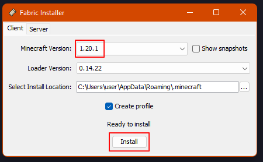
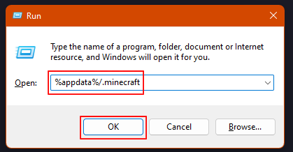
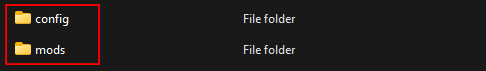

# Fontaine Modpack installation guide

## ***Fabric***

The modpack requires Fabric in order to load mods.

### *Note: If you already have Fabric installed for the version you are using, you can skip this part.*

### **Step 1**

Go to [the Fabric website](https://fabricmc.net/use/installer/) and download either the installer for Windows or the universal jar, it doesnt matter which.

### **Step 2**

Run the installer and select the version you wish to use *(either 1.20.1 or 1.19.4)* and press "Install".

Fabric will now appear as a profile within the Minecraft Launcher.

## ***Modpack Installation***

Installing the mods.

### **Step 1**

Download the modpack for your Minecraft version.

The modpack can be found in the "fontaine pack" thread on #general

### **Step 2**

Press `⊞+R` to open the Run window and type in `%appdata%/.minecraft`, then press Enter.

This will take you to `.minecraft` in Explorer, which is where we will install the mods.

### **Step 3**

**If you have any mods  in `.minecraft/mods` that you no longer want, remove them or place them somewhere else. If you have any older versions of any of the mods in this modpack, remove them aswell.**

Extract the modpack `.zip`, in there you will find a `mods` and `config` folder. 

Select all of these and move them to `.minecraft`.

 

If you get errors about files already existing, this could mean two things:

 

**Files already existing in `.minecraft/mods`:**

This just means you already have one of the mods installed. Skip the file and it will still work.

**Files already existing in `.minecraft/config`:**

This means you may have used one of the mods from this modpack before, or an older version of the modpack. If you get this error, you should backup the file that it is talking about to be safe, then overwrite it.

 

### **You have now successfully installed the modpack, launch Minecraft using Fabric to play.**

 

### **Note about GUI Scale:**

If you do not have your GUI Scale set to 3, the default settings for the armour display will not be correct. You will need to fix this yourself in the configuration for the InventoryHud mod.

## ***Shaderpacks Installation (optional)***

Installing the shaderpacks.

### **Step 1**

Download the shaderpacks `.zip` from the "fontaine pack" thread on #general

### **Step 2**

Extract the shaderpacks `.zip` to `.minecraft/shaderpacks`

If `.minecraft/shaderpacks` does not exist, create it.

### **Step 3**

Go to *Options >> Video Settings >> Shader Packs* in-game to select and configure the shaders.

### **You have now successfully installed the shaderpacks**